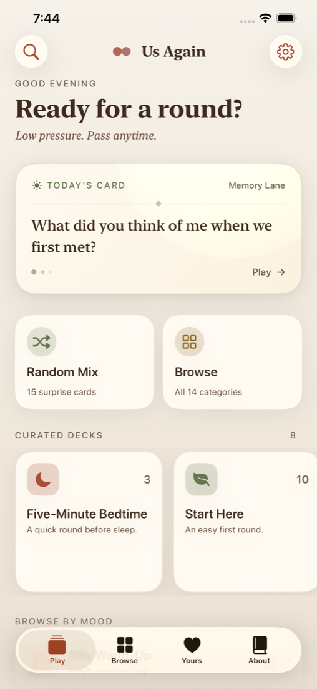
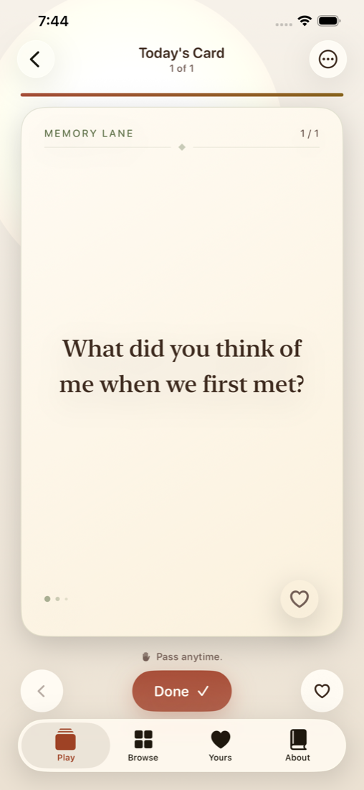
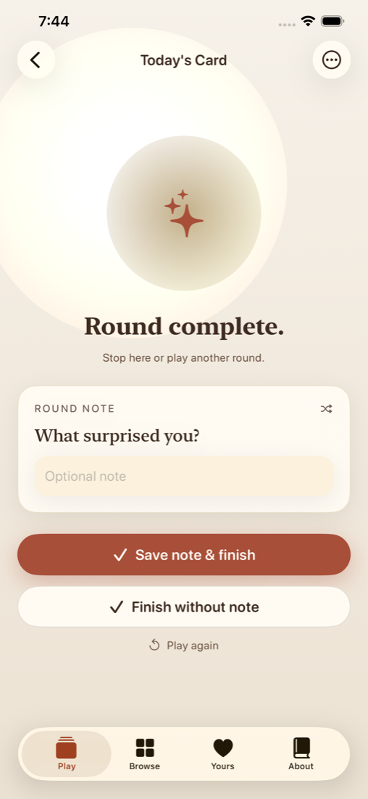
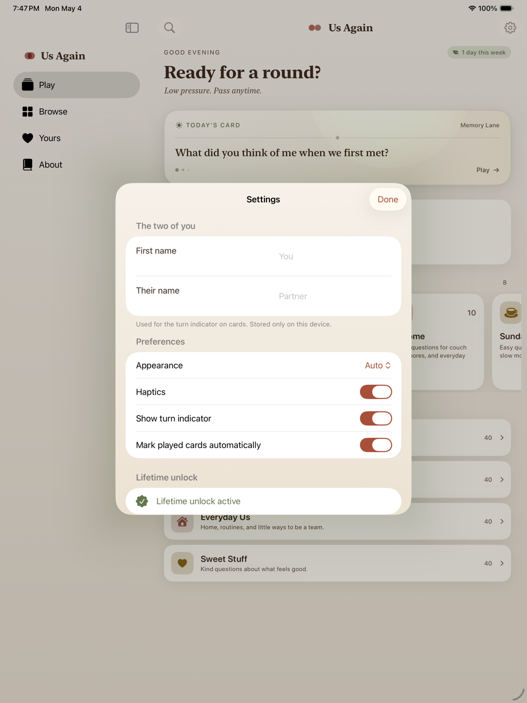

# Us Again

**A private, low-pressure card game for two.**

[Visit the official site](https://usagain.app)

Us Again is an iPhone and iPad card game for couples. Pick a deck, answer a few prompts, pass anything, and stop while it still feels fun.

## How It Works

1. Pick Today's Card, a curated mini-deck, or the full card library.
2. Take turns answering prompts together.
3. Pass any card without explanation.
4. Save private notes and finished rounds on your device.

## Screenshots And Proof Points

| Private rounds | Today's Card | Finished rounds | Private settings |
| --- | --- | --- | --- |
|  |  |  |  |

## Product Facts

- 430 cards across 14 categories.
- 8 curated mini-decks for date night, couch time, road trips, slow mornings, and quick rounds.
- Local-first privacy: no accounts, no tracking, and no internet required.
- Private notes, finished-round history, read-aloud support, reminders, and export.
- Built for iPhone and iPad.

## Source Code

This public GitHub repository is only a promotional pointer to the product and official site. The iOS source code, build files, private configuration, internal documentation, and release materials are not published here.
